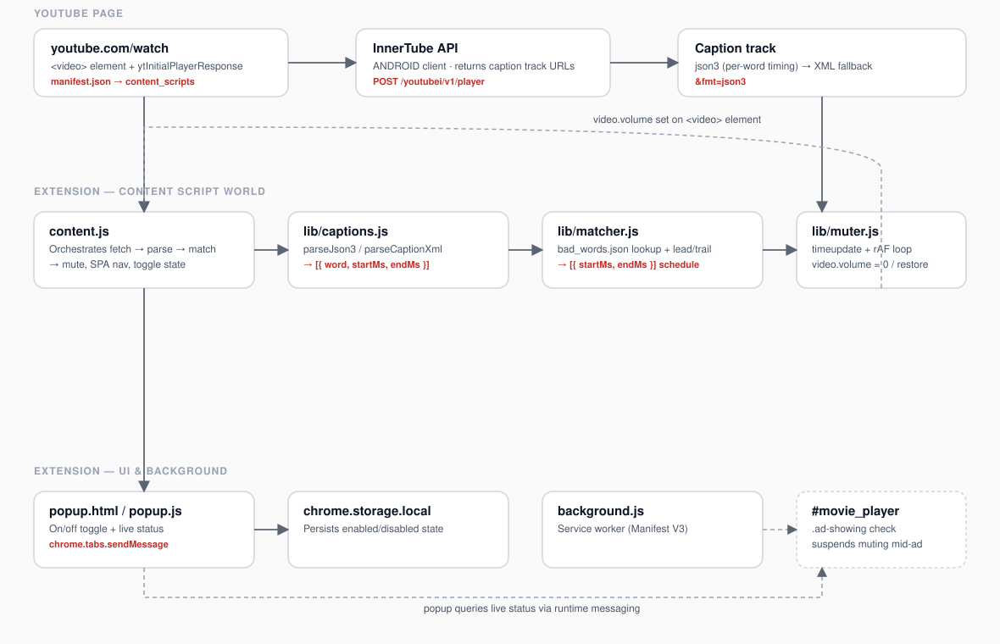

<div align="center">


[](manifest.json)
[](LICENSE)
[](manifest.json)
[](#installation)

**SafeStream** is a lightweight Chrome extension that automatically mutes profanity in YouTube videos in real time — no external services, no account, no data leaving your browser.

</div>

---

## How it works, in one sentence

SafeStream reads YouTube's own auto-generated captions to find *when* a profane word is spoken, builds a mute schedule from that, and silences the video for those exact windows as it plays — automatically re-syncing on every seek and every video you open.

## Features

- **Automatic** — no per-video setup. Works the moment a YouTube video loads.
- **Word-level accuracy** — uses YouTube's `json3` caption format for per-word timestamps, not a rough segment-level guess.
- **Survives backgrounded tabs** — muting keeps working even if you switch tabs while listening.
- **Ad-aware** — muting pauses during ads instead of firing at random points in ad playback.
- **One-click toggle** — enable/disable from the toolbar popup, with live status ("Active — 12 mute intervals").
- **No network calls beyond YouTube itself** — all matching happens locally against a bundled word list; nothing is sent to a third-party server.

## Installation

SafeStream isn't on the Chrome Web Store yet — install it as an unpacked extension:

1. Download or clone this repository.
   ```bash
   git clone https://github.com/devapragadeesh/SafeStream-Extension.git
   ```
2. Open `chrome://extensions` in Chrome.
3. Enable **Developer mode** (top-right toggle).
4. Click **Load unpacked** and select the cloned `SafeStream-Extension` folder.
5. Open any YouTube video — SafeStream activates automatically.

## Usage

Click the SafeStream icon in the toolbar to:
- Toggle muting on/off.
- See live status: whether captions were found, how many mute intervals are scheduled for the current video, and whether they're auto-generated or manual captions.

There's nothing else to configure — SafeStream works out of the box on any English-language YouTube video with captions available.

## Architecture



| File | Responsibility |
|---|---|
| `manifest.json` | Manifest V3 config — permissions, content script registration, popup wiring. |
| `content.js` | Orchestrates everything per video: extracts the video ID, calls YouTube's InnerTube API for caption tracks, wires up SPA-navigation handling so it re-initializes when you click to a new video without a full page reload. |
| `lib/captions.js` | Parses YouTube's caption data into a flat `{ word, startMs, endMs }` list. Prefers the `json3` format (real per-word timestamps) and falls back to segment-level XML if `json3` is unavailable. |
| `lib/matcher.js` | Matches parsed words against `bad_words.json`, applies a small timing buffer to compensate for auto-caption lag, and merges overlapping hits into a mute schedule. |
| `lib/muter.js` | Drives the actual muting. Listens to `timeupdate` (so it keeps working in backgrounded tabs) and `requestAnimationFrame` (for smooth foreground precision), silencing the video by zeroing `volume` — not `.muted`, which YouTube's own player periodically resets. |
| `popup.html` / `popup.js` | Toolbar UI: on/off toggle and live status, backed by `chrome.storage.local`. |
| `background.js` | Manifest V3 service worker (currently minimal — all logic lives in the content script). |
| `bad_words.json` | The bundled, categorized word list (`13+`, `18+`, `slurs`, `global` placeholder patterns) used for matching. |

### Why captions instead of audio analysis?

YouTube's auto-generated captions already censor profanity as `[ __ ]` and time-stamp it — SafeStream reads that signal directly instead of running speech recognition in the browser. It's fast, needs no ML model, and works entirely offline once the caption track is fetched.

## Known limitations

- Requires English captions (auto-generated or manual) to be available for the video.
- Timing accuracy depends on YouTube's own caption timestamps — very rare mistimed auto-captions will mistime the mute too.
- Live streams are captioned in real time by YouTube; SafeStream builds its schedule once at load, so captions that arrive later mid-stream aren't retroactively covered.
- The word list currently has no severity filter in the UI — all categories are always active.

## Contributing

Issues and pull requests are welcome. If you're proposing a change to `bad_words.json`, please explain the reasoning — the list is deliberately conservative to avoid false positives on innocuous words.

## License

[MIT](LICENSE)
